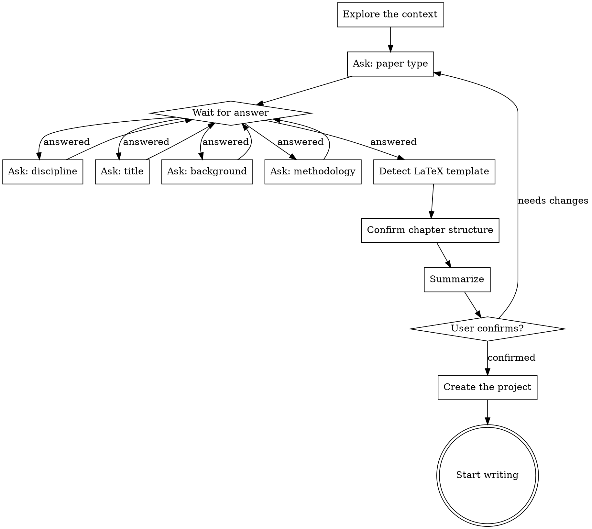

# Research-writing brainstorming

Turn the user's paper idea into a complete writing plan through natural, collaborative dialogue.

**Core rule: ask one question at a time, and wait for the answer before moving on.**

**Interaction rule: make the user confirm rather than choose. Offer a recommendation and let them approve or tweak it.**

<EXTREMELY-IMPORTANT>
## Interaction constraints

Brainstorm **conversationally**. Do not hand the user a form to fill in.

**Do:**
- Ask one question at a time
- Ask in natural language, the way a colleague would
- Wait for the answer, confirm your understanding, then ask the next question
- **Recommend an option and ask the user to confirm** rather than making them start from scratch
- Give your suggestion and the reasoning behind it

**Don't:**
- Dump every question at once
- Number the questions like a form
- Move on before the user answers
- List bare options with no recommendation
- Make the user fill in a blank page

**Contrast:**

Wrong: "Choose one: 1. Bachelor's 2. Master's 3. PhD 4. Journal 5. Conference 6. Coursework"

Right: "What kind of paper are you writing this time — a thesis, a journal submission, or coursework? If it's a thesis, is it at the bachelor's, master's, or doctoral level?"
</EXTREMELY-IMPORTANT>

<HARD-GATE>
Until every question is answered and the user gives final confirmation, you must NOT:
- Write any body text
- Create the `chapters/` directory
- Invoke the writing-chapters skill
- Output the actual content of any chapter

No matter how "simple" the task looks, it goes through this process.
</HARD-GATE>

## Default language

| Paper type | Default language | Notes |
|------------|------------------|-------|
| Bachelor's thesis | Chinese | Unless the user asks for English |
| Master's thesis | Chinese | Unless the user asks for English |
| Doctoral thesis | Chinese | Unless the user asks for English |
| Chinese core journal | Chinese | |
| SCI/SSCI journal | English | Per the journal's requirements |
| Conference paper | English | Mostly international venues |
| Coursework | Chinese | Unless the course requires English |

**Do not ask about language up front** — derive it from the paper type. Adjust only when the user has a specific requirement.

## Existing material

Before the questions, check whether the user already has relevant material:

> "Before we start — if you already have material for the paper (a title, an abstract, a structure your advisor requires), send it over and I'll plan around it. If not, that's fine, we'll start from scratch."

**Wait for the reply.** If material arrives, skim it, extract the key facts, and confirm them during the questions that follow.

## Anti-pattern: "this is too simple to discuss"

Every paper project goes through this process — a coursework essay, a small revision, a single abstract. "Simple" projects generate the most rework, because their assumptions go untested. The discussion can be short, but the information must be presented and confirmed.

## Checklist

In order:

1. **Explore the project context** — check for an existing `plan/`, existing files, and anything the user supplied
2. **Confirm the paper type** — conversationally, and wait
3. **Confirm the discipline** — conversationally, and wait
4. **Confirm the title** — conversationally, and wait
5. **Confirm the background and objectives** — conversationally, and wait
6. **Confirm the methodology** — conversationally, and wait
7. **Detect a LaTeX template** — if one exists, ask whether to use it
8. **Confirm the chapter structure** — **propose the standard structure for the paper type and ask the user to confirm**
9. **Summarize and confirm** — present everything and get final approval
10. **Create the project structure** — create `plan/` and `chapters/`
11. **Hand off to chapter writing** — ask which chapter to start with

## Flow



---

## Dialogue guide

### Question 1: paper type

Ask in natural language and share your observations:

> "What kind of paper are you writing?
>
> For example:
> - A thesis (bachelor's / master's / doctoral)
> - A journal submission (Chinese core journal / SCI)
> - A conference paper
> - Coursework or a report
>
> The type changes the length, structure, and register, so I need this before I can plan."

**Wait for the answer.** Then confirm your understanding:
> "Got it — [paper type]. Papers like this usually use [citation format], and the register leans [characteristic]."

Then move to the next question.

### Question 2: discipline

> "Which field is your research in?
>
> This shapes the writing advice and the chapter plan. Engineering papers emphasize the technical approach and experimental validation; social science papers emphasize the theoretical framework and data analysis; medical papers have specific reporting requirements."

**Wait for the answer.**

### Question 3: title

> "Do you have a title yet? A working title is fine — we can adjust it later.
>
> If you're still deciding, tell me the general direction and we'll work out how to focus it."

**Wait for the answer.**

### Question 4: background and objectives

Ask concretely, based on the discipline and the title:

> "About the research itself:
>
> Why this topic? Did you run into a problem you want to solve, or is there an idea you want to test?
>
> Just describe the background informally — it doesn't need to be polished."

**Wait for the answer.** If the answer is unclear, follow up:
> "Understood. And what do you want this research to achieve? Which specific problem should it settle?"

### Question 5: methodology

The emphasis differs by discipline:

**Engineering:**
> "What technical approach or method are you planning? Any experiments or systems to build? How will you evaluate the performance?"

**Social science:**
> "What's your method — survey, interviews, case study, something else? How will you collect and analyze the data?"

**Medicine:**
> "Is this clinical or basic research? Roughly what sample size? Have you thought about ethics approval?"

**Humanities:**
> "Which theoretical lens are you taking? Where do the texts or materials come from?"

**Law:**
> "Which legal question are you analyzing? Will it involve case analysis or comparative law?"

**Wait for the answer.**

### LaTeX template detection

Check the `latex-templates/` directory.

**If template files exist:**
> "I see you've added LaTeX template files. Do you want the paper output through that template?
>
> With the template, I'll generate `.tex` files you can compile to PDF with LaTeX.
> Without it, I'll write Markdown that you can paste into Word later.
>
> Which do you prefer?"

**If no template exists:** default to Markdown and don't ask.

### Question 6: chapter structure

**Automatically recommend** the structure matching the confirmed paper type:

> "For a [paper type], I'd suggest this chapter structure:
>
> [show the structure for that type, read from templates.md]
>
> This is the standard structure for [paper type]. You can:
> 1. **Confirm it** — we use this structure
> 2. **Tweak it** — tell me which chapters to add, drop, or reorder
>
> Which would you like?"

**Important**: get the user to confirm rather than design. With no special requirement from the user, the default structure is fine.

### Summary and confirmation

Once everything is collected, present the summary:

> "Here's what we've settled on:
>
> - **Paper type**: [type]
> - **Discipline**: [field]
> - **Title**: [title]
> - **Background**: [brief]
> - **Objectives**: [brief]
> - **Methodology**: [brief]
> - **Output format**: [Markdown / LaTeX]
> - **Chapter structure**:
>   - [chapter list]
>
> Is all of that right? Once you confirm, I'll create the project structure and we can start writing."

<HARD-GATE>
Wait for an explicit confirmation ("yes", "correct", "confirmed", "looks good") before continuing.
Never assume agreement.
</HARD-GATE>

---

## Creating the project structure

After confirmation:

1. **Create `plan/`** if it does not exist
2. **Fill in `project-overview.md`:**

```markdown
# Project overview

## Basics

- **Paper type**: [type]
- **Discipline**: [field]
- **Title**: [title]
- **Created**: [date]
- **Output format**: [Markdown / LaTeX]
- **Current stage**: brainstorming complete, ready to write

## Research

### Background
[user's description]

### Objectives
[user's description]

### Methodology
[user's description]

## Chapter structure

[chapter list]

## Writing standards

- **Language**: [Chinese / English]
- **Citation format**: [format]
- **Writing module**: [module]
```

3. **Fill in `outline.md`**: the detailed chapter outline
4. **Update `progress.md`**: record that brainstorming is complete
5. **Create `chapters/`**: with empty chapter files

## Handing off to writing

> "The project structure is ready.
>
> Which chapter would you like to start with?
>
> I'd suggest the introduction, so the research question and objectives are pinned down and the later chapters flow more easily. But if you feel more confident about the literature review or the methods, we can start there.
>
> Where would you like to begin?"

**Wait for the answer**, then invoke the `writing-chapters` skill.

---

## Key principles

- **One question at a time** — don't bury the user under questions
- **Wait before continuing** — never assume the user's choice
- **Conversation, not a form** — talk like a colleague, not a questionnaire
- **Give advice with reasons** — help the user choose instead of listing bare options
- **Adapt** — if the user wants to skip parts of the discussion, streamline it, but never skip the final confirmation
- **Record everything** — every decision goes into `plan/`
