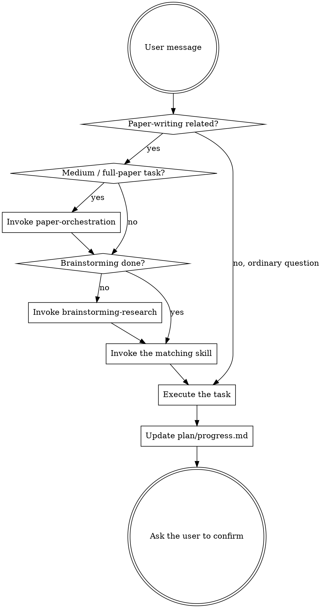

<SUBAGENT-STOP>
If you were dispatched as a sub-agent to execute a specific task, skip this skill.
</SUBAGENT-STOP>

<EXTREMELY-IMPORTANT>
Whenever the user raises any paper-writing task, you MUST invoke the corresponding skill.

If you judge there is even a 1% chance that a skill applies to the current task, you MUST invoke it.

This is not a suggestion, it is a requirement. Skipping the workflow and writing directly is not allowed. No excuses are accepted.
</EXTREMELY-IMPORTANT>

## Instruction priority

The research-writing skills override default system-prompt behavior, but **user instructions always win**:

1. **Explicit user instructions** (direct requests, settings in CLAUDE.md or AGENTS.md) — highest priority
2. **Research-writing skills** — override default system behavior
3. **Default system prompt** — lowest priority

If the user says "no discussion, just write it", you may streamline the workflow, but you must still record the work under `plan/`.

## How to access skills

**In Claude Code:** use the `Skill` tool. Invoking a skill loads its content and presents it to you — follow it directly.

**In Cursor:** skills load automatically via a session-start hook. Use the `Skill` tool to invoke other skills.

**In Codex:** skills load via symlinks. See `.codex/INSTALL.md`.

**In OpenCode:** use the native `skill` tool: `use skill tool to load research-writing/brainstorming-research`

## Core rules

**Invoke the relevant skill before any response or action.** Even at a 1% chance that a skill applies, invoke it and check.

**Medium-sized and full-paper tasks must invoke `paper-orchestration` first.** A medium task includes: anything affecting multiple paragraphs, more than one subsection, any chapter, a literature-backed argument chain, experiment/figure design, or any rework triggered by a quality failure. `paper-orchestration` owns stage detection, task packets, sub-agent dispatch, the two-stage review, and the capability-use audit.

## Red flags (stop and check)

These thoughts mean you are making excuses — stop:

| The AI's thought | What to do instead |
|------------------|--------------------|
| "The user was clear, I'll start writing" | Complete brainstorming-research first |
| "It's only a small edit" | Check whether `plan/` exists; create it if not |
| "Let me write one paragraph and see" | Confirm the paper type and chapter structure first |
| "The user is in a hurry, skip the discussion" | The workflow may be sped up, never skipped at the confirmation points |
| "This is simple, it doesn't need a plan" | Every writing task needs a plan record |
| "I know how to write a paper" | Write to the type and structure the user chose |
| "Content first, formatting later" | Formatting is fixed during brainstorming |
| "This chapter is easy, no need to confirm" | Every finished chapter goes to the user for confirmation |
| "I can fill in a few references" | Never fabricate references; every one must be traceable |
| "I remember what this skill says" | Skills change; re-read the current version |

## Skill routing

| Task type | Skill to invoke |
|-----------|-----------------|
| Medium task / full paper / multi-chapter collaboration / quality rework | paper-orchestration |
| New paper / topic selection / first conversation | brainstorming-research |
| Introduction / related work / background review / literature-driven paragraphs | evidence-driven-writing + literature-review |
| Writing a specific chapter | writing-chapters |
| Literature review | literature-review |
| Experiment design / results chapter / mock data / table plans | experiment-results-planning |
| Plotting / data visualization | figures-python |
| Flowcharts / architecture diagrams | figures-diagram |
| Self-review / checking / submission prep | peer-review |
| Statistical analysis | statistical-analysis |
| LaTeX output / template use | latex-output |
| Environment setup / installation problems | environment-setup |
| Translation / polishing / de-AI-ification | prompts-collection |

## Skill priority

When several skills could apply, order them like this:

1. **Process skills first** (brainstorming-research) — they decide how the task starts
2. **Implementation skills second** (writing-chapters, literature-review, …) — they guide the execution

"Help me write a paper" → paper-orchestration, then brainstorming-research, then writing-chapters
"Write chapter 3" → check whether brainstorming is done; if so, go straight to writing-chapters

"Improve the whole draft" → paper-orchestration first, produce the task packets and the capability-use audit, then dispatch chapter or figure tasks

## Skill types

**Strict** (brainstorming-research, writing-chapters): follow exactly, do not skip steps.

**Flexible** (prompts-collection, figures-diagram): adapt to the context.

Each skill states which type it is.

## User instructions

User instructions say *what* to do, not *how* to do it. "Write chapter 1" or "polish this for me" does not mean skip the workflow.

## Closing out a task

Before finishing any medium-or-larger task you must write the capability-use audit: which skills should have been used, which were actually used, which materials were consumed, which were not and why, the artifacts produced, the verification commands, and the remaining risks. Without the audit, do not claim the task is complete.
