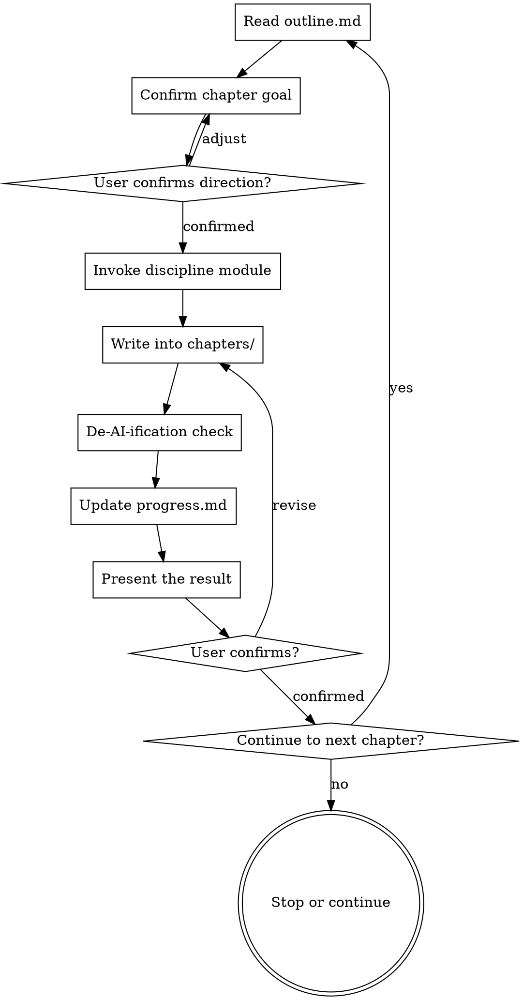

# Chapter writing

Owns the actual writing of each chapter. Invoke it only after brainstorming is complete and the project structure exists.

<HARD-GATE>
Before invoking this skill, all of the following must hold:
1. `plan/project-overview.md` exists and states the paper type and chapter structure
2. `plan/outline.md` exists and has been confirmed
3. The `chapters/` directory exists

If any condition fails, invoke the brainstorming-research skill first.
</HARD-GATE>

<HARD-GATE>
Determine the chapter type before writing:

1. Introduction, Related Work, background, literature review: invoke `evidence-driven-writing` first and read `refs/evidence-map.md` or `plan/evidence-map.md`.
2. Methodology / Methods: write it as an input-to-output technical flow, not a list of modules.
3. Results, Discussion, experimental results: invoke `experiment-results-planning` first and confirm either real data or clearly labeled mock/synthetic planning data.

No user request justifies going straight into body text. Instructions like "make it read naturally", "don't be vague", or "mind the transitions" translate into sentence, paragraph, structure, and evidence handling — nothing else.
</HARD-GATE>

## Checklist (per chapter)

- [ ] Read `plan/outline.md` and confirm this chapter's goal and key points
- [ ] If `plan/chapter-architecture.md` exists, confirm this chapter's filename, minimum body length, and agent owner
- [ ] Check that prerequisite chapters are done (in logical order)
- [ ] Confirm the chapter's key claims and direction with the user
- [ ] Invoke the writing module for the discipline
- [ ] For introduction / related work, read the evidence-driven-writing outputs
- [ ] For method chapters, check the input-to-output flow
- [ ] Run the body-text contamination firewall check
- [ ] Write the output to `chapters/XX-name.md`
- [ ] **Stage 1: compliance check**
- [ ] **Stage 2: quality check (de-AI-ification, fluency)**
- [ ] Update `plan/progress.md`
- [ ] Present the result and ask the user to confirm or revise
- [ ] Once confirmed, ask whether to continue to the next chapter

## Chapter agent contract

Full-paper drafts and redrafts must use a separate fresh agent for each major chapter. The controller prepares the task packet and review criteria; the chapter agent writes only its assigned file.

Each chapter agent must receive:

- the exact chapter file it owns;
- the chapter's role in the whole manuscript;
- required source files and evidence IDs;
- paragraph-level argument chain, not a list of section labels;
- minimum prose length from `plan/chapter-architecture.md`;
- prohibited wording and prohibited structure;
- instructions to report unresolved gaps instead of inventing evidence or results.

Each chapter agent must return:

- status: DONE, DONE_WITH_CONCERNS, NEEDS_CONTEXT, or BLOCKED;
- changed file path;
- short summary of argument chain;
- unresolved evidence/data gaps;
- self-review against the rejection checks.

The controller must record this in `plan/chapter-agent-provenance.md`. A chapter without provenance is not accepted for a full-paper redraft.

## Two-stage review

Run both checks after finishing each chapter.

### Stage 1: compliance

Does the chapter meet the basic requirements?

| Check | Notes |
|-------|-------|
| Length | Does it hit the target length (±10% acceptable)? |
| Structure | Is the chapter structure complete, are the subsections clear? |
| Citation format | Is it consistent (GB/T 7714 or APA)? |
| Heading levels | Do they follow the paper's conventions? |

**Result**: pass / needs revision

### Stage 2: quality

| Check | Notes |
|-------|-------|
| De-AI-ification | No mechanical transitions, no hollow emphasis openers |
| Fluency | No repetition, no redundancy |
| Academic register | Objective subjects such as 本文 / 本研究 ("this paper", "this study") |
| Paragraph structure | Continuous prose preferred; no stacked bullets |
| Citations are real | Every citation is traceable, none fabricated |

**Result**: pass / needs revision

## Writing workflow



## Preparation

### 1. Read the project information

From `plan/`:
- `project-overview.md`: paper type, discipline, research background
- `outline.md`: chapter outline and key points
- `progress.md`: chapters already finished
- `notes.md`: user preferences and special requirements

**Structure templates**: see `skills/brainstorming-research/templates.md` for the standard structures of each paper type.

### 2. Confirm the current chapter

> "According to the outline, chapter «[name]» covers:
> - [point 1]
> - [point 2]
> - [point 3]
>
> Confirm these, or tell me what to adjust:"

### 3. Invoke the discipline module

| Discipline | Module |
|------------|--------|
| Engineering, natural science | writing-core |
| Humanities | writing-humanities |
| Social science | writing-humanities (data-weighted) |
| Medicine | writing-medical |
| Law | writing-law |

## Writing standards

<EXTREMELY-IMPORTANT>
These standards are mandatory. Do not skip them in the name of "efficiency" or "simplification".
</EXTREMELY-IMPORTANT>

### De-AI-ification

For Chinese manuscripts, the banned strings below are the literal forms to avoid:

1. **No mechanical transitions**: 首先、其次、最后、此外、另外、总之
2. **No hollow emphasis openers**: 值得注意的是、需要指出的是、重要的是、显而易见
3. **No subjective framing in the body**: 我认为、我觉得、我的研究
4. **No stacked bullets**: the body prefers continuous prose over bullet points
5. **Objective tone**: use 本文, 本研究, 研究表明 ("this paper", "this study", "the research shows")

### Argue, don't enumerate

Each chapter must form a continuous argument rather than flattening its points into short paragraphs. Every body paragraph should follow one of these patterns:

- Background: scenario constraint → the research tension → what this chapter takes up.
- Literature: the problem this line of work shares → representative evidence → the boundary not yet covered.
- Method: input object → processing → output form → design rationale.
- Experiment: evaluation goal → comparison setup → what the metric means → the boundary of acceptable conclusions.
- Discussion: what the result means → engineering/scholarly interpretation → limitations and follow-up validation.

Do not write these patterns as lists. Every body paragraph needs a causal, contrastive, connective, or qualifying relation. Apart from the reference list, the body carries no bullet points by default; if the contributions genuinely need a list, cap it at 3 items and explain them in the surrounding paragraphs.

### Length and density

In a full first draft, the main chapters — Introduction, Methodology, Experimental Results and Analysis, Discussion — must not be abstract-level summaries. If `plan/chapter-architecture.md` sets `min_chars`, meet that floor. If you cannot, return NEEDS_CONTEXT or keep expanding; never mark a short draft as complete.

### Formatting

1. **Blank line between paragraphs**
2. **No bold in the body** (except the first definition of a term)
3. **No italic emphasis**
4. **Clear heading hierarchy**

### Citations

1. **Never fabricate references**
2. **Citations must be traceable**: at least two of author, year, and source must be complete
3. **English sources may be cited after being retrieved**
4. **For Chinese sources, prefer to have the user supply them**

## Chapter templates

### Confirmation before writing

> "I'm about to write «[chapter name]».
>
> **Goal**: [from the outline]
> **Estimated length**: [based on the paper type]
> **Subsections**:
> - [subsection 1]
> - [subsection 2]
>
> Confirm or adjust, and I'll start:"

### Presentation after writing

> "The first draft of «[chapter name]» is done.
>
> **Actual length**: [count]
> **Contents**: [brief summary]
>
> Saved to: chapters/[filename].md
>
> Please review:
>
> ---
> [preview of the chapter, e.g. the opening]
> ---
>
> Tell me the location and the change if you want revisions; once you confirm, I'll update the progress file."

### Recording progress

In `progress.md`:

```markdown
## [date] - [chapter name]

- **Status**: done / needs revision
- **Length**: [count]
- **User confirmed**: yes / no
- **Revision log**: [if any]
```

## Guidance for specific chapters

### Abstract

- Write it after the body is finished
- 300–500 characters for a Chinese abstract, with a matching English abstract
- Structure: background, objective, method, results, conclusion
- No citations, no figures or tables

### Introduction

- Research background (broad to specific)
- Research problem (the gap in existing work)
- Objectives and significance
- Overview of scope and methods
- A short paragraph on the paper's structure is fine, but it must not substitute for the research-gap argument
- CS/engineering SCI papers usually fold Related Work into the Introduction; do not split out a standalone Related Work chapter unless the outline or template requires it

### Literature review

- Invoke the literature-review skill
- Organize by theme, chronology, or method
- Must include critical analysis
- Must identify the research gap

### Methods

The method chapter follows an input-to-output flow, not a module list:

1. Input: data form, samples, features, constraints.
2. Preprocessing or representation: cleaning, encoding, splitting, normalization.
3. Core model/algorithm: for each module, state its input, processing, output, and design rationale.
4. Training or inference procedure: equations, algorithms, parameter updates, decision paths.
5. Output: predictions, explanations, alerts, metrics, or downstream interfaces.
6. Correspondence with the experiments: every key module must map to an ablation, a control, or a stated limitation.

Do not write "it consists of three layers" or "it includes several modules" and then omit the data flow, the equations, and the reproducible steps.

### Results and discussion

The results chapter must not retain process notes — experiment purpose, table slots, backfill templates, discussion prompts, "user to replace this". Real results are backed by data; mock data may only appear as planning data, must keep the `[待真实实验替换]` marker, and must never be written as a verified conclusion.

## Body-text contamination firewall

The contamination firewall checks that:

1. The user's revision requests never leak into the body text.
2. Process notes never leak into the body or the appendix.
3. Compressing is not emptying: the core claims, evidence, method conditions, and boundaries must survive.
4. A table never replaces a paragraph of argument that the paper owes the reader.
5. Lists appear only where the target journal allows them or the contributions are exceptionally clear; the body defaults to continuous prose.

### Conclusion

- Summarize the findings
- Answer the research objectives
- State the novel contributions
- Point to future directions

## Error handling

### If `plan/` does not exist

> "The project structure hasn't been created. Brainstorming has to be finished before writing can start.
>
> Shall we start brainstorming now?"

Invoke brainstorming-research.

### If a prerequisite chapter is unfinished

> "I'd suggest finishing «[prerequisite chapter]» before «[current chapter]», because:
> - [reason]
>
> Do you want to write the prerequisite first, or skip ahead?"

Record the user's choice in `notes.md`.

### If the user asks to skip confirmations

> "Understood — I'll streamline the confirmation steps, but I still need a quick confirmation after each chapter.
>
> Starting «[chapter name]» now."

## Key principles

- **One chapter at a time** — finish and confirm before starting the next
- **Every chapter is confirmed** — never continue automatically
- **Progress is always updated** — write to `progress.md` after every session
- **Style stays consistent** — follow the discipline module's conventions
- **Citations are always real** — never fabricated
