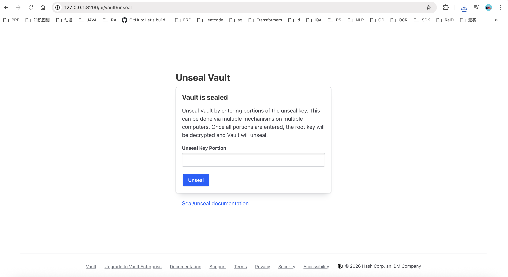
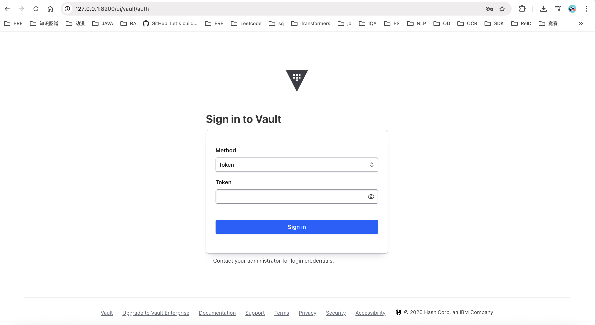
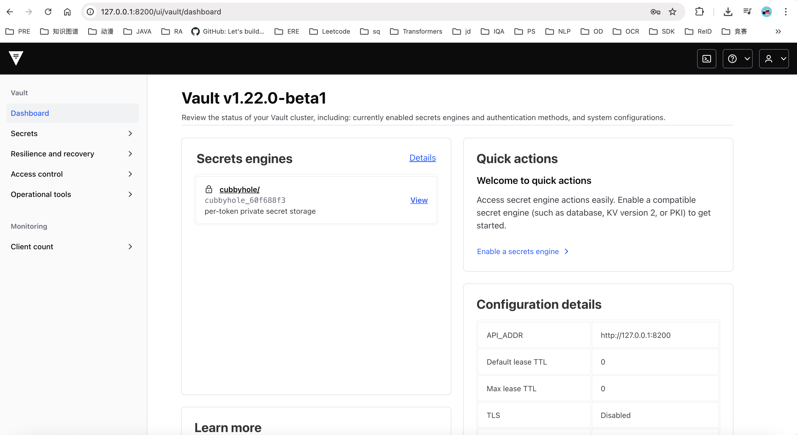
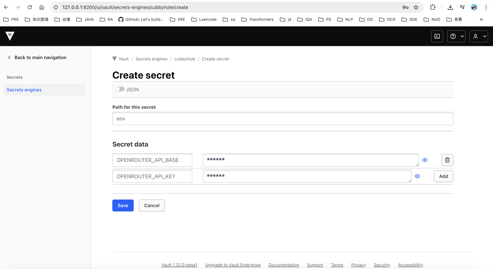

# 前言

> 🌐 English version: [INSTALL.md](INSTALL.md)

## 快速开始

一条命令即可装好运行 agent 所需的全部环境：

```bash
bash scripts/install.sh
```

它会创建 conda 环境（`agentos`，Python 3.12）、安装本包及其依赖、安装 Node.js、
生成 `.env` 模板，并在最后做一次校验。重复执行是安全的——已存在的环境会被复用。

```bash
bash scripts/install.sh --extras browser   # 额外安装 playwright 与 chromium
bash scripts/install.sh --extras sandbox   # 额外构建容器沙箱镜像（需要 Docker）
bash scripts/install.sh --uv               # 用 uv 代替 conda
bash scripts/install.sh --help             # 查看全部选项
```

随后在 `.env` 里填入你的 API Key 即可运行：

```bash
conda activate agentos
python examples/run_meta_agent.py --task "..."
```

本文档余下部分逐项说明各个环节，以及需要集中管理密钥的团队所用的 Vault。

## 密钥从哪里读取

框架优先从 **Vault** 读取密钥（前提是已配置且可连通），否则从 **`.env`** 读取
（见 `autogenesis/utils/hvac_utils.py`）。因此 Vault 是**可选**的：它能让密钥不
以明文落盘，对共享环境或生产环境有意义；而本地开发只用 `.env` 就够了。

只用 `.env` 的话，可直接跳到第二节，并按如下方式设置各家 provider 的变量：

```bash
ANTHROPIC_API_BASE='...'      # 末尾带不带 /v1 都可以，需要时框架会自动剥离
ANTHROPIC_API_KEY='...'
OPENROUTER_API_BASE='...'
OPENROUTER_API_KEY='...'
GOOGLE_API_BASE='https://generativelanguage.googleapis.com'
GOOGLE_API_KEY='...'
```

# 一、安装API Key管理软件（可选）

## Step1: 

```bash
1. 如果已经安装了，直接启动服务
vault server -config=/mnt/agent-framework/<yourt user path>/myapp/vault/config/vault.hcl > /mnt/agent-framework/<yourt user path>/myapp/vault/vault.log 2>&1 &

2. 如果还未安装，使用安装脚本
cd scripts
chmod +x install_vault.sh 
./install_vault.sh /mnt/agent-framework/<yourt user path>/myapp # 会默认本地启动服务http://127.0.0.1:8200, vscodel连接服务器会默认做端口映射，所以直接点击vscode弹射出窗口进入http://127.0.0.1:8200链接就可以进入到前端
```

## Step2: 设置平台登录验证秘钥个数为1
**Key shares**设置为**1**, **Key threshold**设置为**1**，最后点击**Initialize**


## Step3: 
可以看到有两个key一个是**Initial root token**，一个是登录用验证**unseal token key1**，一定要记录下来!!!也可以保存到本地（点击**Download Keys**下载json文件到本地）

建议把**Initial root token**放到项目根目录下的.env里
```bash
VAULT_ADDR='http://127.0.0.1:8200'
VAULT_TOKEN="<initial root token>"
UNSEAL_TOKEN='<unseal token key1>'
SECRET_ENGINE_PATH='cubbyhole/env'
```


然后点击**Continue to Unseal**

## Step4: 
输入key是**unseal token key1**


## Step5: 
输入的key是**Initial root token**


## Step6:
可以看到登录成功了，有一个秘钥本是**cubbyhole/**，点击**View**


## Step7:
点击**Create secret**, path设置为**env**，这样和.env里的**SECRET_ENGINE_PATH='cubbyhole/env'**对应


## Step8:
点击**填入key:value即可**，最后点击**Save**，这样就配置完毕。也可以选择直接粘贴正确格式的json串如下


需要填入的key应该包括：
```bash
{
  "AWS_CLAUDE_API_BASE": "公司内aws-claude路径base url（必填）",
  "AWS_CLAUDE_API_KEY": "公司内aws-claude路径api key（必填）",
  "FIRECRAWL_API_BASE": "官网firecrawl的base url，例https://api.firecrawl.dev/v2（必填）",
  "FIRECRAWL_API_KEY": "官网firecrawl的api key（必填）",
  "INT_OPENROUTER_API_BASE": "公司内openrouter路径base url（必填）",
  "INT_OPENROUTER_API_KEY": "公司内openroute路径api key（必填）",
  "JINA_BASE_URL": "公司内jina base url（必填）",
  "JINA_API_KEY": "公司内jina api key（必填）",
  "SERPER_BASE_URL": "公司内serper base url（必填）",
  "SERPER_API_KEY": "公司内serper api key （必填）",
  "OPENROUTER_API_BASE": "官网openrouter的base url，例https://openrouter.ai/api/v1（选填）",
  "OPENROUTER_API_KEY": "官网openrouter的api key（选填）"
}
```


## Step9: 最后验证是否配置成功
```
export VAULT_ADDR='http://127.0.0.1:8200'
export VAULT_TOKEN='你的Initial root token'
vault kv get -field=OPENROUTER_API_KEY cubbyhole/env

输出内容是你的OPENROUTER_API_KEY内容:
abcabc...
```

# 二、安装python环境

推荐 Python 3.12(最低 3.11)。所有依赖都声明在 `pyproject.toml` 里(不再有 `requirements.txt`)。

## Step1 — 方式 A：安装脚本（推荐）

```bash
bash scripts/install.sh                 # conda 环境 "agentos"
bash scripts/install.sh -n myenv        # 换一个环境名
bash scripts/install.sh --extras all    # 安装全部可选 extras
```

它相当于自动完成下面的方式 B / C，外加 Node.js 安装与最终校验。用了它就可以直接跳到 Step2。

## Step1 — 方式 B：conda + pip
```bash
conda create -n agentos python=3.12
conda activate agentos
pip install -e .              # 核心依赖 + autogenesis 包（并注册 `autogenesis` 命令行）

# 可选 extras（浏览器自动化 / 化学 / 沙箱）：
pip install -e ".[browser]"   # 或 ".[chem]" ".[sandbox]" ".[all]"

# playwright / browser-use 需要一次性下载浏览器：
python -m playwright install chromium
```

## Step1 — 方式 C：uv（更快、可复现）
[uv](https://docs.astral.sh/uv/) 是 pip/venv 的高速替代；`uv sync` 会依据 `pyproject.toml`
+ 已提交的 `uv.lock` 安装,环境可复现。
```bash
# 安装 uv（一次即可）
curl -LsSf https://astral.sh/uv/install.sh | sh

# 创建 .venv 并安装核心依赖 + 本包（使用 uv.lock）
uv sync
source .venv/bin/activate            # Windows: .venv\Scripts\activate

# 可选 extras：
uv sync --extra browser              # 或 --extra chem / sandbox / all

# playwright / browser-use 需要一次性下载浏览器：
python -m playwright install chromium
```

> 说明：`pip install -e .` / `uv pip install -e .` 会把本仓库装成可导入的 `autogenesis` 包，
> 其他项目就能 `import autogenesis`，同时得到 `autogenesis` 命令。运行产生的数据落在当前目录
> （或 `$AUTOGENESIS_HOME`），绝不会写进已安装的包里。

## Step2: 配置 `.env`

用 Vault 的话，让框架能找到它：
```bash
VAULT_ADDR='http://127.0.0.1:8200'
VAULT_TOKEN="<initial root token>"
UNSEAL_TOKEN='<unseal token key1>'
SECRET_ENGINE_PATH='cubbyhole/env'
```

不用 Vault 的话，直接写各家 provider 的凭证即可（见前言）。当 Vault 未配置或
连不通时，框架会自动改用这些值，无需其他改动。

# 三、Node.js（仅 Web UI 需要）

[`frontend/`](../frontend/) 下的浏览器界面是一个 Vite 应用，需要 Node.js：

```bash
conda install -n agentos -c conda-forge nodejs   # 或用 nvm / 系统包管理器
cd frontend && npm install && npm run dev
```

`scripts/install.sh` 会帮你装好 Node.js。跑 agent 本身——CLI、TUI 以及
`examples/run_*.py` 脚本——都**不需要**它：trace 事件会写入
`<log_root>/trace/*.jsonl`，并由 Gateway 推送给前端。

# 四、容器沙箱与镜像

Agent 会把不可信的工作（浏览器会话、代码执行、benchmark 洁净室）放到隔离的
Docker 容器里运行。只要在安装时带上 sandbox extra，构建这些镜像就是一键安装的
一部分：

```bash
bash scripts/install.sh --extras sandbox   # 构建下面的 peer 镜像
bash scripts/install.sh --extras all       # sandbox + browser + 全部
```

安装脚本的第 5 步会检查 Docker 守护进程，可连通时构建：

| 镜像 | 构建自 | 使用方 |
| --- | --- | --- |
| `autogenesis/chrome-vnc:latest` | `docker/chrome-vnc/` | `browser_environment`、`webapp_testing_skill` —— 虚拟显示上的有头 Chrome，带 **noVNC 实时画面** |
| `autogenesis/code-interpreter:latest` | `docker/code-interpreter/` | 沙箱化的 code-interpreter peer |

构建是幂等的——已存在的镜像不会重建。各 Dockerfile 的 `FROM`（`opensandbox/*`
基础层）会自动拉取，OpenSandbox 自己的辅助镜像（`execd`、`egress`）由沙箱服务
在首次使用时拉取，因此无需再手动准备其他东西。

想手动单独（重）构建某个镜像：

```bash
docker build -t autogenesis/chrome-vnc:latest       docker/chrome-vnc/
docker build -t autogenesis/code-interpreter:latest docker/code-interpreter/
```

> **Model X 启动镜像**（`autogenesis/base`）是另一回事——它是整个框架**运行于
> 其内部**的基础容器，而不是 peer 沙箱。它通过 `docker/base/` 与
> `scripts/run-in-sandbox.sh` 构建和使用（详见 `docker/base/README.md`）。

# 五、其他

```bash
1. 测试模型调用
curl -X POST "https://xxx/v1/responses" \
  -H "Content-Type: application/json" \
  -H "Authorization: Bearer xxx" \
  -d '{
    "model": "gpt-5.4-pro",    
    "input": "hello",
    "max_output_tokens": 2048
  }'

curl -X POST "https://xxx/v1/chat/completions" \
  -H "Content-Type: application/json" \
  -H "Authorization: Bearer xxx" \
  -d '{
  "model": "openai/gpt-5.4",
  "messages": [
    {
      "role": "user",
      "content": "Hello"
    }
  ],
  "temperature": 0.7,
  "max_tokens": 2048
}'
```
